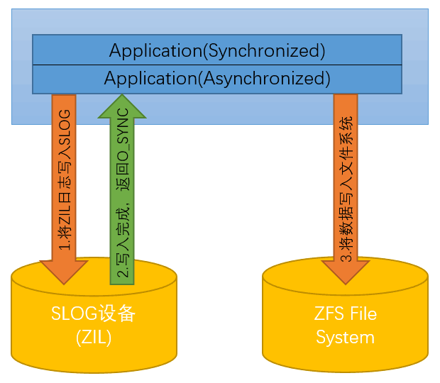

> 参考文档：
>   [http://www.xiangzhiren.com/archives/288](http://www.xiangzhiren.com/archives/288)
>   参考资料的OS Version: FreeNAS-11.1-U2
>

# ZFS高速缓存介绍：ZIL和L2ARC

- ZFS采用高速缓存来加速读写操作。但这并不是绝对的。理想状态下，所有的缓存数据都应该保存在内存中，但这样做成本太高了。因此，数据会自动的缓存在不同速度的硬件上，以平衡性能和成本。需要频繁访问的数据缓存在内存中，访问频繁程度略低的数据可以缓存在稍微慢一些的设备上，比如SSD固态硬盘。不需要经常访问的数据则不做缓存，仍让它呆在硬盘中。如果突发大量读旧数据，ZFS将自动将这些数据移动到SSD固态硬盘或内存中。

## 关于写缓存ZIL

- 介绍ZIL(ZFS Intent Log)之前，要和另一个名词SLOG区别一下。SLOG是ZFS文件系统中用于存放ZIL的一个高速存储设备，最佳的SLOG设备是一个小型的基于闪存的设备，比如如SSD或NVMe卡，他们的特点是具有的高性能，低延迟以及发生断电时数据的持久性。即使在硬件设备中没有SLOG，ZIL仍然会被保存在ZFS文件系统中。ZIL是日志文件，是一个系统对数据写入操作的意图的日志文件，相比于需要写入的数据本身，这个日志文件会小很多很多。ZFS目前在SLOG设备中只使用16 GB的空间。安装较大的SLOG设备也不会使用额外的空间。SLOG设备不能在池之间共享。每个池需要一个单独的SLOG设备。带宽和吞吐量限制要求SLOG设备只能用于这一个目的。不要尝试在同一个SLOG设备上添加其他缓存功能，否则性能将受到影响。

- ZFS文件系统中的同步写入和异步写入与其他文件系统相似，当需要把数据写入磁盘时，它可以在写入磁盘之前由操作系统的内核缓冲在系统内存中，或者可以立即写入磁盘(同步写入)，或者等待磁盘空闲时再写入(异步写入)。需要异步写入的数据因为是被缓存在内存中，所以具有极快的访问速度，但若缓存在被写入磁盘之前突发断电等情况，就不能保证数据的完整性。而同步写入是由应用程序设置的O_SYNC标志，在写入完成时返回给操作系统。同步写入可以保证数据的完整性，对于一致性关键型应用程序（如数据库和某些网络协议（如NFS）），最好采用进行同步写入操作，但这会降低写入性能。

- ZFS的写缓存是内存。ZFS设定了定时器，每隔一段时间将内存中修改的数据写到磁盘上，在定时器触发时间没到的情况下，所有的数据都缓存在内存中。而当定时器被触发，ZFS文件系统主要有三种方式将内存中的数据写入磁盘。

1.先将ZIL写入SLOG设备，等待下一次同步时将数据写入文件系统，这时客户端收到信号后可以立刻去做其他事情。在下一个同步数据触发信号触发时，系统将数据写到文件系统中。

2.将数据写入文件系统，同时将ZIL写入SLOG设备，ZIL写入完成后返回O_SYNC。这样可以防止突然断电等情况，文件系统可以找到上次写入数据的位置进行恢复。

3.关闭写入ZIL，直接将数据写入文件系统。

从上面三种方式对比来看，在方式1中，由于SLOG设备比存储设备速度要快很多，而且ZIL在数据写完之后就会删除，使得SLOG设备有大量连续空间，所以会很快返回O_SYNC标志，应用程序就可以接着做其他的事情，而不需要等待数据完全写入低速的存储设备。所以，当存在SLOG设备作为ZIL写缓存时，会大大提升写入效率。

并且，需要注意的是，在默认的情况下，ZFS是开启ZIL写入的。如果没有SLOG设备该怎么办？这时，ZFS会在文件系统中划出一块空间来作为ZIL设备使用，上面最快方式1就变成下面的样子：

此时，也就意味着一份数据要在ZFS文件系统中写入2次才能正式保存，而且由于ZIL文件体积小，而且写入频繁，会对文件系统的性能带来一定的影响。所以，官方的建议是：建议使用SLOG设备；在关键任务系统中，强烈建议使用镜像SLOG设备。
关于读缓存L2ARC

ZFS在RAM中提供的读取缓存称为ARC，可以减少读取延迟。如果使用SSD固态硬盘专门作为缓存设备，则称为 L2ARC。ARC之外的读取数据会在L2ARC中缓存，由此提高随机读取性能。既然ARC和L2ARC都是用于作为读取缓存的，为什么FreeNAS仍然要求“尽可能多的增加内存”？那是因为L2ARC没有减少对足够RAM的需求。实际上，L2ARC需要RAM来运行。如果没有足够大的RAM来存放足够大的ARC，那么添加L2ARC不会提高性能。在大多数情况下，性能实际上还会有所下降，可能导致系统不稳定。RAM始终比SSD固态硬盘快，所以在考虑系统是否可以从L2ARC设备中获得更快的读取速度之前，请添加尽可能多的RAM。通常，不应将L2ARC添加到RAM小于64GB的系统中，并且L2ARC的大小不应超过RAM的五倍。
总结

ZIL和L2ARC只是ZFS文件系统所支持功能中的一小部分，想更好的使用FreeNAS系统，充分发挥他的的潜力，首先要了解作为FreeNAS存储基石的ZFS文件系统，请浏览《了解FreeNAS中的ZFS文件系统》先对ZFS做一个初步的认识。

