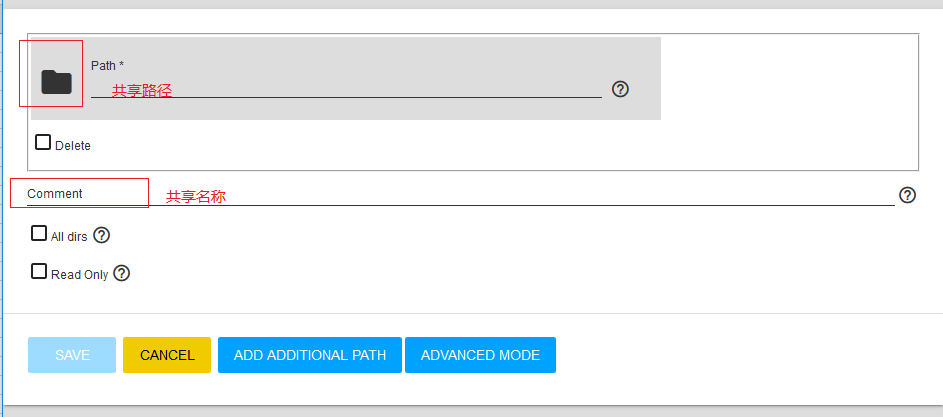

> - 参考资料
>   - [http://www.xiangzhiren.com/archives/436](http://www.xiangzhiren.com/archives/436)
>   - 参考资料的OS Version: FreeNAS-11.1-U2
>
# 创建NFS配置

## 一、采用匿名方式配置

## 二、创建Pool
- 创建数据池-nfspool
- 设置权限，设置用户为nobody，用户组设置为nogroup，赋予其他用户读取权限

## 三、创建NFS共享，并开启服务
- 