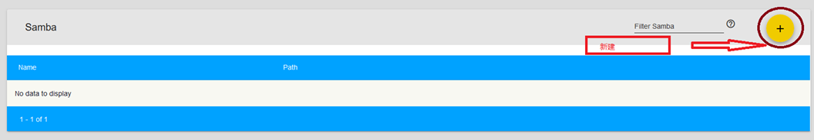
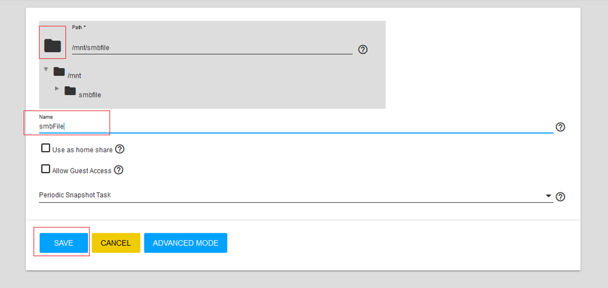
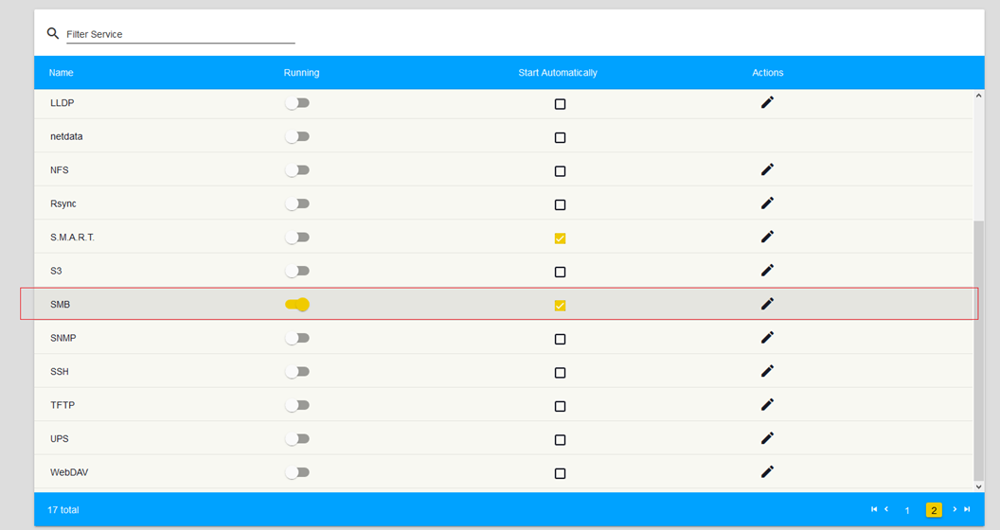

> - 参考资料
>   - [http://www.xiangzhiren.com/archives/401](http://www.xiangzhiren.com/archives/401)
>   - 参考资料的OS Version: FreeNAS-11.1-U2
>
# 创建SMB共享

## 新建用户
- 新建用户组[smbGroup]
- 新建用户[smbadmin],并设置到刚才新建的组[smbGroup]
- 方法参见《创建用户教程》

## 创建数据池
- 新建数据池[smbfile]
- 方法参见《创建Pool》

## 创建共享信息
- 1. 添加SMB共享信息
- 

- 2. 填写基本信息
- 

## 开启SMB服务
- 