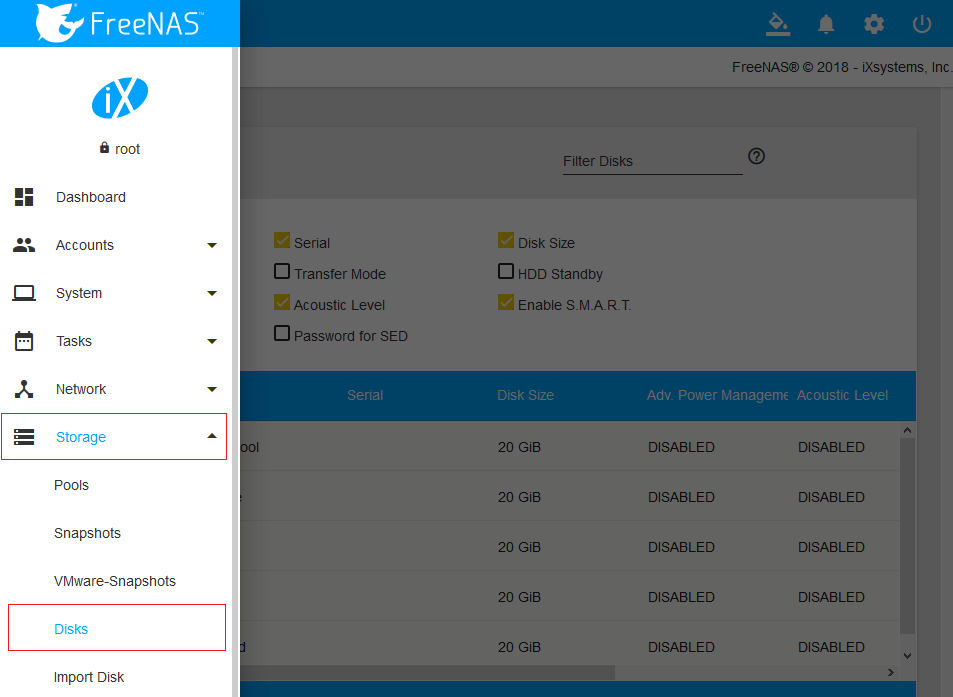
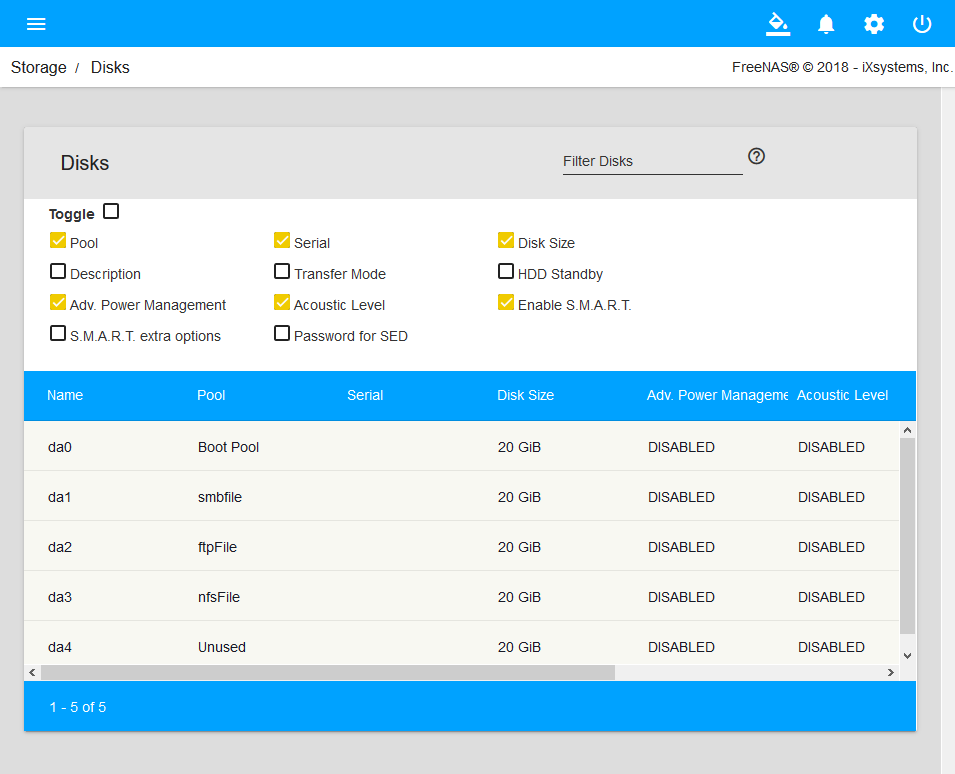
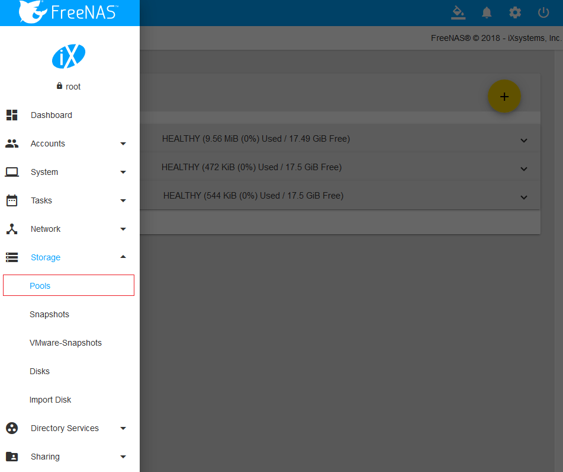
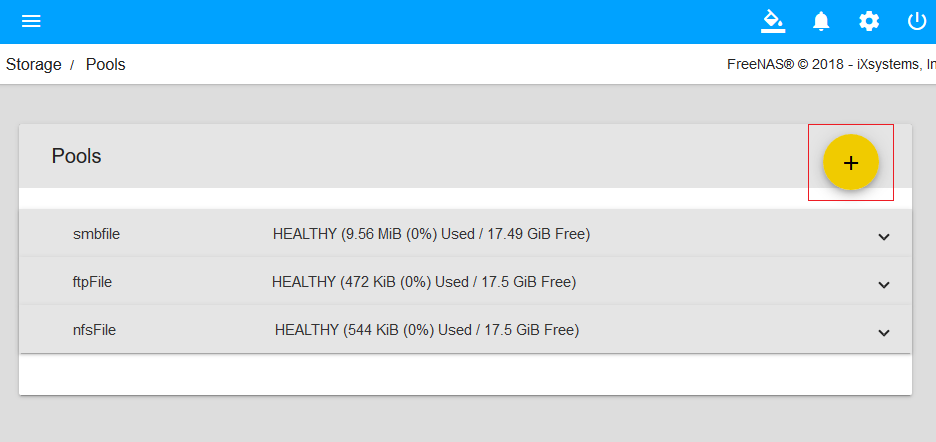
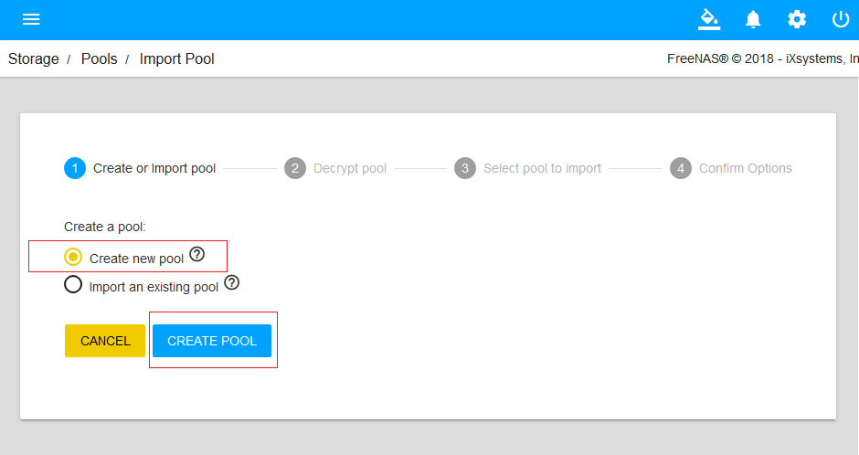
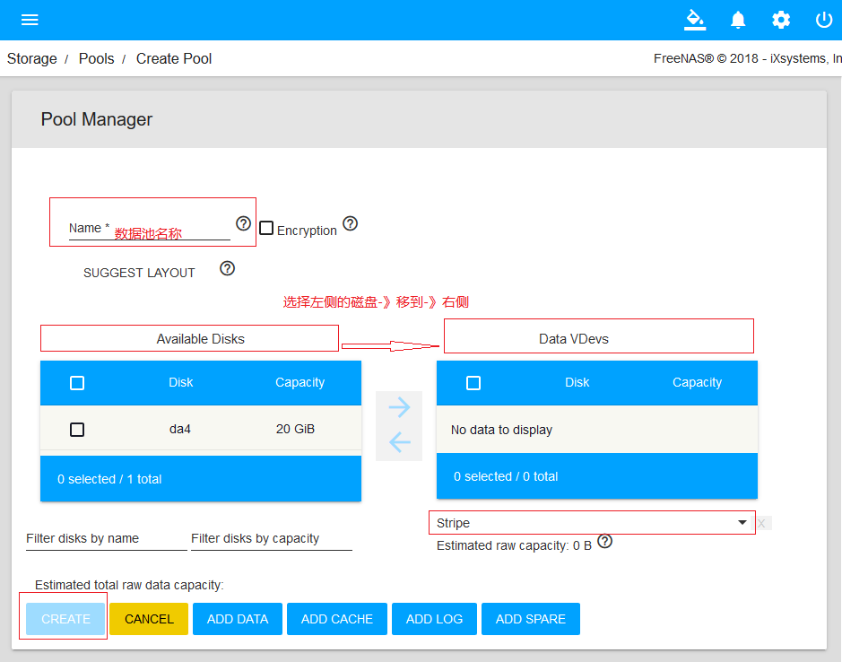
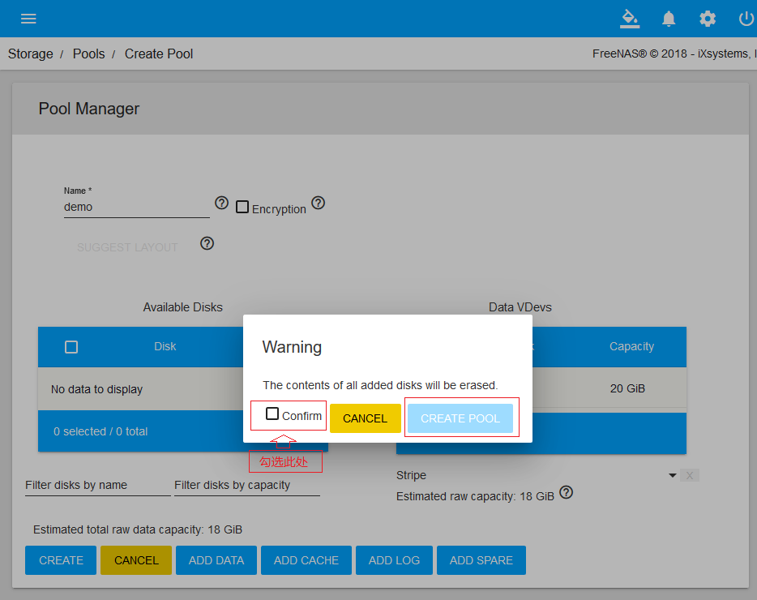

> - 参考文档：
>       [http://www.xiangzhiren.com/archives/298](http://www.xiangzhiren.com/archives/298)
> - 参考资料的OS Version: FreeNAS-11.1-U2
>

# 在FreeNAS中创建和数据池

### 创建数据池

#### 首先进入WebUI的管理界面，点击“Storage”存储器图标，再点击“Disks”查看磁盘按钮

#### 显示系统可管理的所有磁盘

#### 再点击“Pools”图标，打开“Pools”管理页面

#### 点击右上角的“+”号，新增“Pools”

#### 创建Pool

#### 填写信息

#### 确认修改

