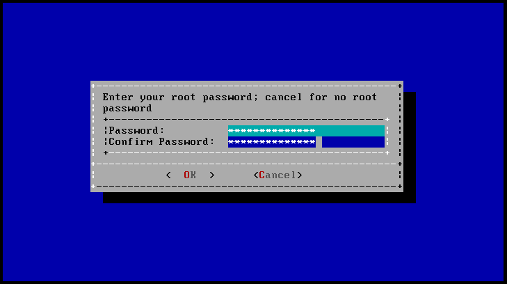

> - 参考文档：
>       [http://www.xiangzhiren.com/archives/140](http://www.xiangzhiren.com/archives/140)
>   参考资料的OS Version: FreeNAS-11.1-U2
>

- 家里自己组装了一台服务器，折腾完各种操作系统，接了几块硬盘开始定位于NAS，NAS系统选了又选，先后折腾了OMV、NAS4FREE，最后还是觉得FreeNAS最顺手，所以打算记录一下这个开源的NAS系统。因为服务器已经在正常使用，为了数据安全，一般都是先虚拟机测试，OK了才开始在服务器上操作，所以，这篇记录也就是从虚拟机开始。

### 1.新建一个虚拟机。因为FreeNAS是基于FreeBSD的，所以采用自定义方式新建。
- 

### 2.如果不考虑迁移到其他版本的VM，虚拟机兼容性可以选择最新版本。
- 

### 3.为避免VM的智能安装，这里选择“稍候安装操作系统”。
- 

### 4.选择“其他”中的FreeBSD，这里要注意一下版本问题，FreeNAS11是基于FreeBSD11的，而且只提供64位版本。
- 

### 5.虚拟机名称随意，见名知意即可，然后选择一个目录保存。
- 

### 6.处理器配置根据宿主机的配置设置。
- 

### 7.内存按照官方建议，至少8G。
- 

### 8.网络类型选择桥接，这样才能把FreeNAS连接到家庭网络中。
- 

### 9.I/O控制器默认推荐即可。官方建议是直接使用AHCI模式连接硬盘，如果需要扩展硬盘接口，可以使用LSI的HBA卡，官方建议不实用Raid。
- 

### 10.创建一个虚拟磁盘。
- 

### 11.大小默认的20G即可，这个磁盘用于安装FreeNAS11的系统。
- 

### 12.为虚拟磁盘文件取名，默认保存在之前设置的保存虚拟机文件目录中。
- 

### 13.选择自定义硬件。
- 

### 14.设置虚拟光驱，使用FreeNAS11的安装光盘映像。
- 

### 15.再添加4块虚拟硬盘作为FreeNAS的数据存储。
- 

### 16.默认SCSI。
- 

### 17.创建虚拟磁盘
- 

### 18.稍微大点，100G
- 

### 19.默认即可。
- 

### 20.重复操作，添加4块100G虚拟磁盘。
- 

### 21.开启虚拟机，进入FreeNAS安装界面，选择“FreeNAS Installer”，另外一个是允许串口接口的安装模式。
- 

### 22.请无视加载虚拟键鼠的提示。选择第一项“Install/Upgrade”。
- 

### 23.选择安装系统的磁盘，这里选择那个20G的虚拟磁盘。
- 

### 24.设置root用户密码，该密码用于安装完成后在WebUI中登录root用户。
- 

### 25.FreeNAS11允许使用UEFI方式或者传统BIOS方式启动，在实际中要根据真实电脑的主板来进行选择。
- 

### 26.安装完成，提示重启。
- 

### 27.选择第三项，重启。注意此时系统并未完成安装，重启后还会继续进行安装。
- 

### 28.第一次重启后会直接从安装硬盘启动。
- 

### 29.等到出现如下界面，表示安装已经完成。可以通过提示的IP地址方位FreeNAS的WebUI。
- 

### 30.输入安装过程中的root用户密码进行登录。
- 

### 31.安装完成。
- 