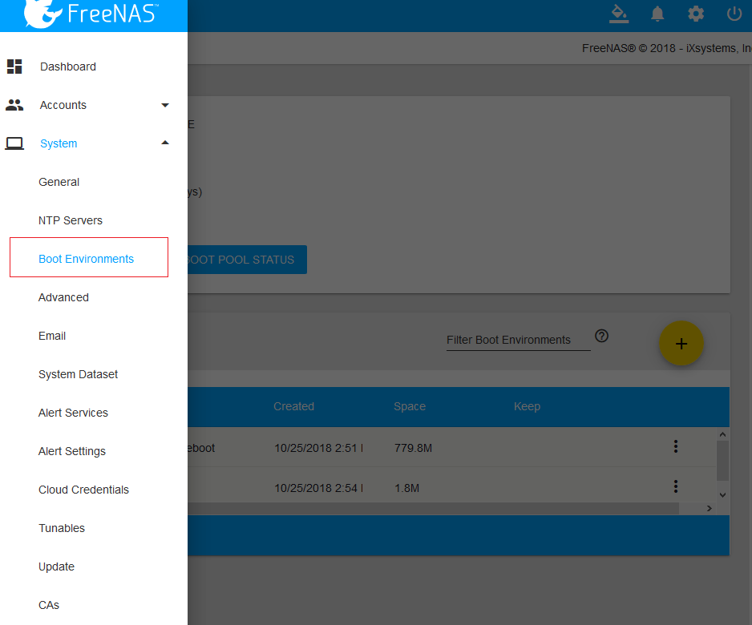
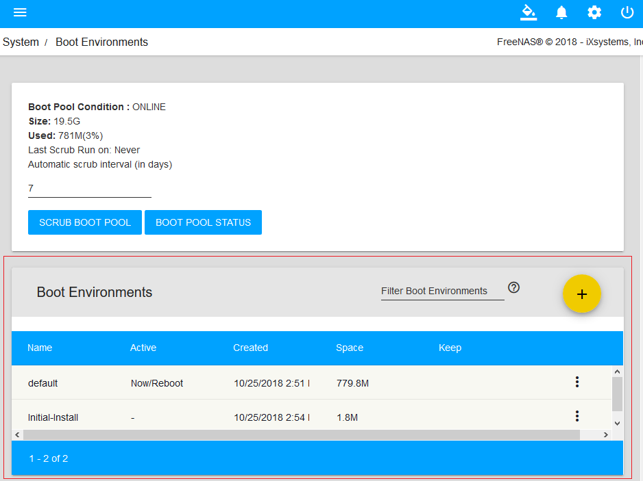

> - 参考文档：
>       [http://www.xiangzhiren.com/archives/358](http://www.xiangzhiren.com/archives/358)
>   参考资料的OS Version: FreeNAS-11.1-U2
>

# 多重引导环境

## 引导环境
- 在WebUI中点击“System”系统，在点击“Boot Environments”引导环境，查看当前系统的引导环境
    - 
    - 
    - 列表中字段信息：
        - Name：引导环境名称，当系统引导时，它将显示在Grub引导菜单中。
        - Active：引导环境状态。指明当前引导环境”Now”，默认引导环境”On Reboot”，或者两种状态兼而有之。
        - Created：表示引导环境创建的日期和时间
        - Space：在用空间
        - Keep：表示如果引导设备没有足够的空间可供继续执行更新，是否可以删除此引导环境。

- 引导环境
    - default： 系统安装完成后并配置好(比如系统名称、网络环境等)的引导环境
    - Initial-Install: 原始的未进行配置的系统的引导环境

- 在右侧最后一列，有三个点，点击有个菜单，内有四个选项
    - Clone     克隆，对选启环境克隆一个副本
    - Rename    重命名，修改启动环境的名称
    - Activate  激活，只有选择非当前引导环境时才会显示此按钮。此按钮用来设置默认启动环境，下次启动系统时将以这个被激活的引导环境启动。点击按钮后，所选的引导环境状态将显示为“On Reboot”，而当前环境的状态也会从“On Reboot,Now”变为“Now”。
    - Keep/Unkeep   保留/不保留。用于切换引导环境的Keep状态。如果安装系统的设备没有足够的空间来继续更新，是否可以自动删除此引导环境。  

## 查询更新，在“System”系统的“Update”更新
- 
