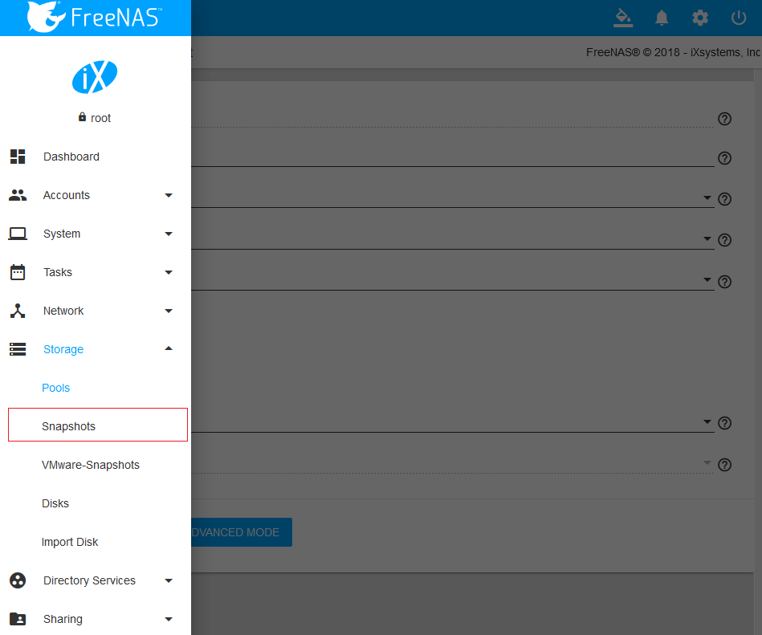
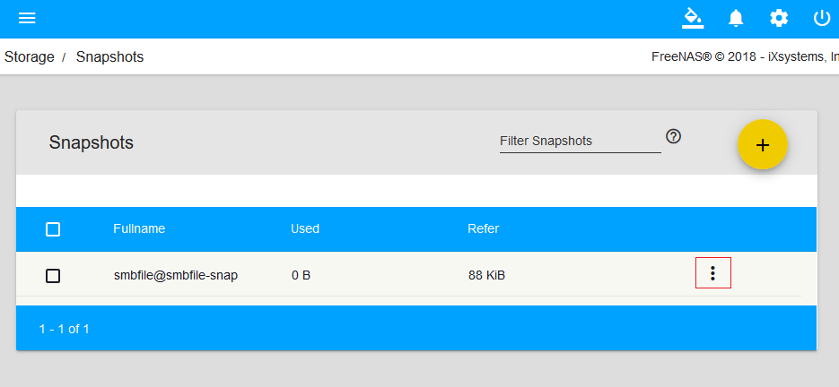
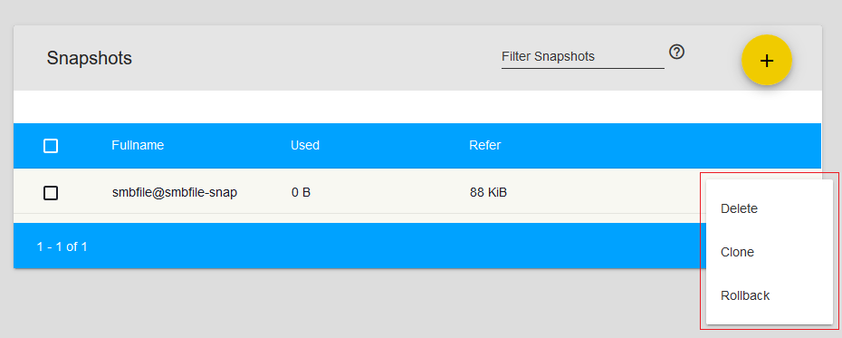
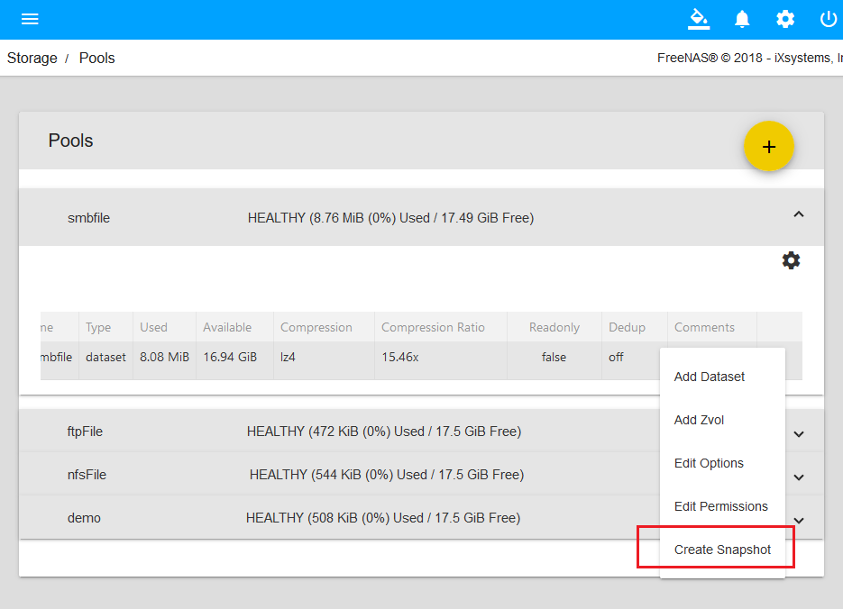
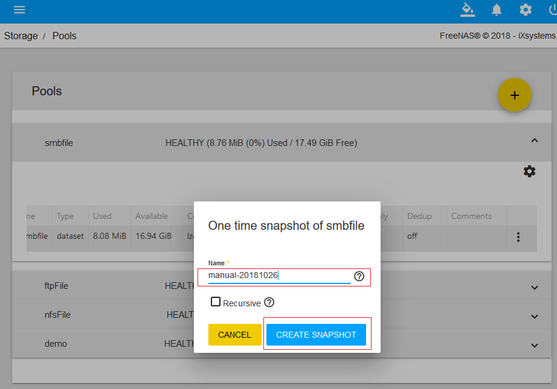
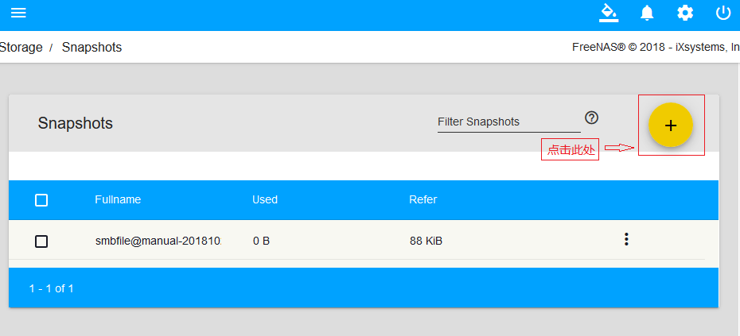
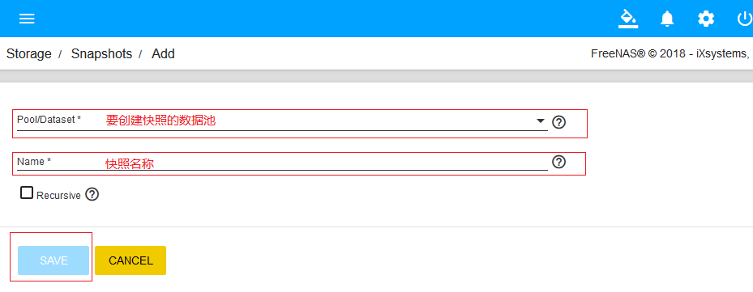
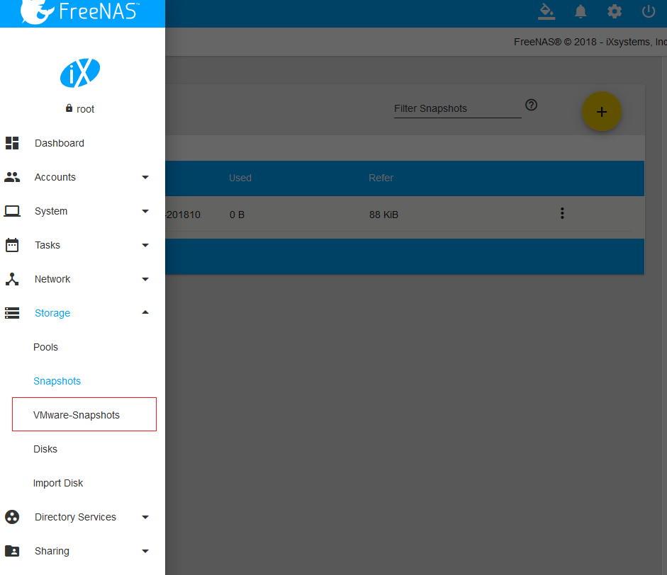
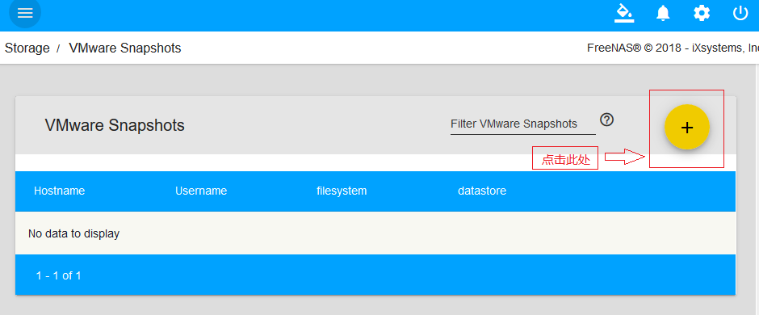
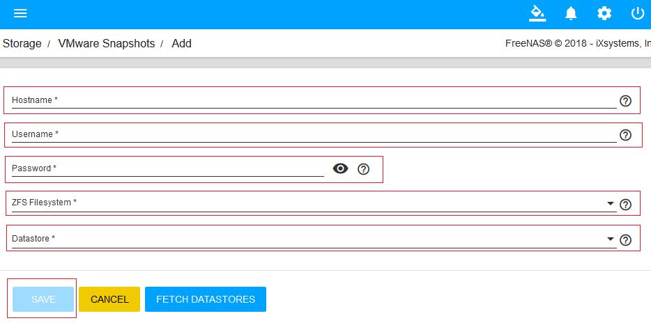

> - 参考文档：
>       - [http://www.xiangzhiren.com/archives/326](http://www.xiangzhiren.com/archives/326)
>       - [http://www.xiangzhiren.com/archives/345](http://www.xiangzhiren.com/archives/345)
>       - 参考资料的OS Version: FreeNAS-11.1-U2
>

# ZFS快照介绍：Snapshot

## 什么是Snapshot(快照)？

- 快照是一种重要的存储数据的技术，可以在不停止应用程序的情况下对数据进行备份。数据备份是实现数据安全的一种方式，传统的数据备份一般是冷备份，在备份数据时需要停止系统运行才行进行，在数据备份期间，系统无法进行正常的数据访问等操作，但对于许多关键性应用环境，比如电子商务系统、银行系统、金融系统等，系统必须连续不断的运行，但为了数据安全又必须进行数据备份，而停止系统就意味着业务无法进行，停机来进行数据备份就会带来不可估量的损失。Snapshot技术就是为了解决这种问题提出的一种解决方案，Snapshot能在补停止应用程序的情况下生成某一时刻的数据快照，用户可以对这个数据快照进行保存备份，当系统出现问题比如数据丢失时，用户可以安全方便的将生成快照那一时刻的数据恢复到系统当中。

- Snapshot，直译就是“快照”，是本地保留的按时间点保存的数据映像。产生一个Snapshot快照，并不是对所有数据块进行拷贝，只是对文件系统当前时间点的信息做一个快速的记录。快照不能被直接访问，但是可以对快照进行克隆、备份、回滚等操作，通过这些操作，来保护系统当中的重要数据。

## Snapshot的建立过程

- 当我们需要对数据进行备份，我们会建立一个当前时刻与原始数据完全一致的映像，为了做到这点，必须在这一时刻完成全部数据的复制操作。通常，这种复制数据的行为不可能在“一瞬间”内完成。但如果使用Snapshot技术来创建当前时刻的数据映像，就算数据量再大，一般也会在数秒内完成映像的创建。这是因为，建立Snapshot时，并不对所有数据进行完全复制，它所做的只是通知文件系统将目前有数据的磁盘区块全部保留起来，保证所有保存了数据的磁盘区块在这一时刻之后不被覆写。这个通知动作只需要花费极短的时间就可以完成。接下来，任何对数据的增删改操作，均不会覆写原本数据所在的磁盘区块，而是将这些会导致原始数据产生变化的部分写入其他可用的磁盘区块中。

## 实现Snapshot的方式

- 目前实现Snapshot快照技术两种方式：一种是即写即拷(Copy-on-Write)，生成的快照也叫做指针型快照，另一种是分割镜像(Split-Mirror)，生成的快照也叫做镜像型快照。指针型快照的特点是占用空间小，对系统性能影响小，但如果原始数据盘损坏，快照中的数据就无法恢复了。镜像型快照实际就是当时数据的完整镜像，这个生成是一个较慢的过程，而且会对系统性能造成负荷，但原始数据损坏与否并不影响数据的恢复，不过因为是镜像型快照是原始数据的完整镜像，它要占用相等容量的存储空间。

- Copy-on-Write可以在每次输入新数据或更新已有数据时生成对存储数据改动的Snapshot，这样可以在放生硬盘写入错误、文件损坏或者程序故障时迅速恢复数据，但在恢复数据时必须保证原始数据可供使用。Copy-on-Write也被称为“元数据”拷贝，所有的数据并没有真正被拷贝到另一个位置，只是指示数据所处位置的指针被拷贝，从而使得实际用于保存Snapshot虽然占用空间很小，却完全依赖于原始数据的可用性。

- Split-Mirror引用原始数据中的所有数据。每次引用运行时，都生成整个数据保存空间的Snapshot，而不仅仅是新数据或者更新的数据，这种方式可以实现离线访问数据，并简化了恢复、复制或存档一块硬盘上所有数据的过程，但这是一个较慢的过程，而且每个Snapshot会占用更多的存储空间。

## ZFS文件系统中的Snapshot

- 如果你还不太了解ZFS文件系统，可以阅读《了解FreeNAS中的ZFS文件系统》对ZFS文件系统做了一个简单的了解。

- ZFS通过使用Copy-on-Write方式提供Snapshot功能。ZFS下的Snapshot为系统提供了更安全有效的数据保护方式。在创建一个新的Snapshot快照时，系统仅仅简单的复制一个根节点，新的Snapshot节点与原始的根节点指向完全想通的数据块，一段时间后，如果数据块发生了变化，比如删除一个文件，那么在文件系统中这个文件已经不再存在，但在磁盘上并没有真正删除这个文件，Snapshot快照中仍然保存着指向这个文件所在位置的数据块，也就是说，通过Snapshot仍然可以找回这个文件。如果在文件系统中修改一个文件，系统在修改之前会复制这个文件所在的数据块，然后修改根节点的相关数据，最后才对这个文件进行修改，这样，使用Snapshot仍然可以找回被修改的部分。

- ZFS文件系统中的Snapshot是文件系统的只读副本，Snapshot快照几乎可以即时创建，而且最初不占用池中的其他磁盘空间。但是，当活动数据集中的数据发生更改时，快照通过继续引用旧数据占用磁盘空间，从而阻止释放磁盘空间。

- ZFS文件系统中的Snapshot具有以下特征：

    - 可在系统重新引导后保存下来。
    - 理论最大快照数是2的64次方。
    - 快照不使用单独的后备存储。快照直接占用存储池（创建这些快照的文件系统或卷所在的存储池）中的磁盘空间。

## FreeNAS Snapshot 快照

- Snapshot(快照)是一种非常简单实用的备份方式，得益于强大的ZFS文件系统，使得FreeNAS中各种数据的备份和恢复的操作都简单快捷。在FreeNAS中利用快照对数据进行备份，就像我们用GHOST备份操作系统一样，但两相比较，快照的备份数据占据更小的空间，因为它并不是一个完整的数据拷贝，而只是对数据集中的数据变化做记录，我们利用快照备份数据，实际上就是对这个记录留存一个副本而已。为一个数据集创建的第一个快照，几乎不会占用任何存储空间，而当数据集中的数据发生变化时，快照的体积才会慢慢增加。

## 管理Snapshot
- 在WebUI中选择“Storage”，再点击“Snapshot”快照
    - 
    - 
    - 
    - 界面内容
        - 第一列：Fullname 快照全名
        - 第二列：Used 表示此快照已占用的空间
        - 第三列：Refer 表示快照可访问的数据量，包含创建快照时卷/数据集的大小已经创建快照之后数据集变化的数据量
        - 第四列：点击后包含三个选项，“Clone(克隆快照)”,“Rollback(回滚快照)”,“Delete(销毁快照)”
            - 克隆快照会提示输入要创建的克隆的名称。克隆的快照实际上是快照的可写副本，是一个可以挂载的数据集，因此它将出现在“Pools”选项卡而不是“Snapshot”(快照)选项卡中。
            - 销毁快照会弹出窗口要求确认。在克隆父快照之前，子克隆必须销毁。需要注意的是，虽然创建在快照时非常快的，但销毁快照时会需要大量读写磁盘，并且可能需要很长时间，尤其是启用重复数据删除时。因为为了删除快照中的块，ZFS必须遍历所有分配的块以查看该块是否在其他地方使用，如果不是，才会释放相应的存储空间。
            - 回滚快照会弹出窗口要求确认。如果点击“Yes”，则会将卷/数据集恢复到创建快照时的状态。

## 创建Snapshot

### 方式一
- 在“Storage”的“Pools”里创建快照
    - 
    - 填写信息
    - 

### 方式二
- 在“Storage”的“Snapshots”的创建快照
    - 
    - 填写信息
    - 

## VMware虚拟主机快照
- 在“Storage”的“VMware-Snapshots”的创建快照
    - 菜单
    - 
    - 创建按钮
    - 
    - 填写信息
    - 

