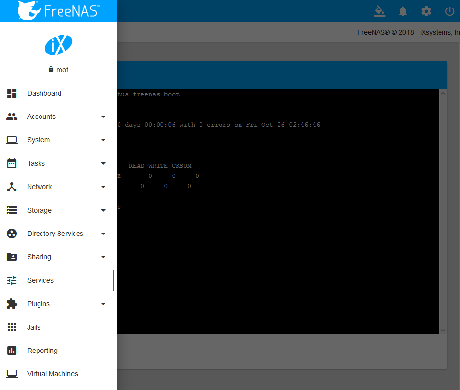
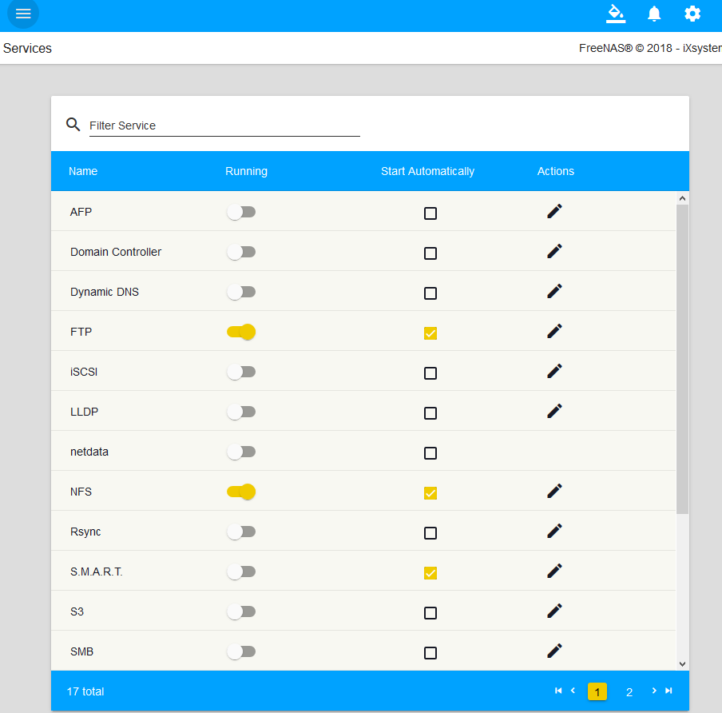
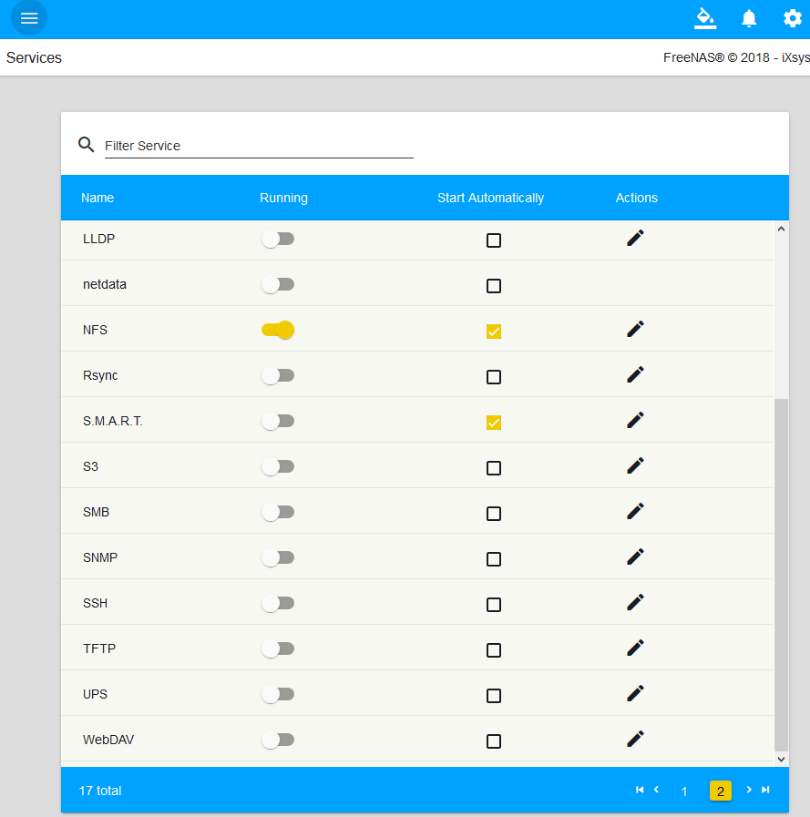

> - 参考资料
>   - [http://www.xiangzhiren.com/archives/394](http://www.xiangzhiren.com/archives/394)
>   - 参考资料的OS Version: FreeNAS-11.1-U2
>

# 服务说明

- FreeNAS系统最主要的功能和用途就是提供文件共享，在FreeNAS系统中默认提供的17个服务之中，有9个是涉及到文件共享的。这9个文件共享方式，让几乎所有可联网的设备都可以访问FreeNAS系统管理的文件
    - 菜单
    - 
    - 服务列表
    - 
    - 其他服务信息
    - 

### AFP
- AFP是Apple Filing Protocol的简写，是一种网络协议，专门为Apple公司的Mac提供文件服务，比如Apple的AirPort Time Capsule，现在改名叫时间返回舱(怪怪的)，就是基于AFP协议为Mac提供文件共享功能。

### Domain Controller
- 域控制器是指在“域”网络中，负责每一台联入网络的设备和用户的验证工作的服务器，是Microsoft公司Windows Server提供的一项功能，而在FreeNAS中，也可以利用Samba提供域控制器的相应功能。

### Dynamic DNS
- 动态域名解析。动态域名解析服务可以将用户的动态IP地址(如家庭宽带用户每次拨号获取到的IP地址)映射到一个固定的域名上，每当设备连接网络时，动态域名解析服务就会通过信息传递把该设备的动态IP地址传送给位于服务商主机上的服务器程序，服务程序负责提供DNS服务并实现动态域名解析。就是说DDNS捕获设备每次变化的IP地址，然后将其与固定的域名相对应，这样域名就可以始终解析到非固定IP的设备上。比如花生壳程序等。

### FTP
- FTP 是File Transfer Protocol(文件传输协议)的英文简称，主要用于Internet上的控制文件的双向传输，Upload(上传)和Download(下载)。比如虚拟主机一般都会提供FTP服务供用户上传网站程序。

### iSCSI
- iSCSI是Internet Small Computer System Interface的简写，翻译成中文就是“互联网小型计算机系统接口”。iSCSI是由IBM开发的，是一个供硬件设备使用的、可在IP协议上层运行的SCSI指令集，是一种开放的基于IP协议的工业技术标准。iSCSI协议可以用TCP/IP对SCSI指令进行封装，使得这些指令能够通过基于IP网络进行传输，从而实现SCSI和TCP/IP协议的连接。

### LLDP
- 链路层发现协议。按照ISO的OSI模型，计算机网络被划分为7层，其中作为通讯子网的底三层分别是物理层、数据链路层、网络层，而LLDP就是工作在其中的数据链路层中的一种协议，它是一个厂商无关的二层协议，它允许网络设备在本地子网中通告自己的设备标识和性能

### Netdata
- 这是一个实时性能和监控系统，通过WebUI显示FreeNAS系统的性能数据，并实时监控系统状态，诸如CPU、内存、磁盘、网络这些基础系统资源。

### NFS
- NFS（Network File System）即网络文件系统，主要用于类Unix系统的文件共享，它允许网络中的计算机之间通过TCP/IP网络共享资源。在NFS的应用中，本地NFS的客户端应用可以透明地读写位于远端NFS服务器上的文件，就像访问本地文件一样。NFS共享很适合在Linux和Unix系统中应用，它的工作效率高，资源占用低，是FreeNAS中性能最好的共享方式。

### Rsync
- Rsync是linux系统下的数据镜像备份工具。使用快速增量备份工具Rsync可以远程同步，支持本地复制，或者与其他SSH、Rsync主机同步

### S3
- S3是Simple Storage Service(简单存储服务)的简写。S3说的玄乎一点可以叫云存储，通俗一点就是大网盘。其概念类似于分布式文件系统，S3是由Amazon推出的，用户通过Amazon提供的服务接口可以将任意类型的文件临时或永久地存储在S3服务器上，S3的总体设计目标是可靠、易用及很低的使用成本。在FreeNAS中通过使用Minio提供基于Amazon S3规范的存储服务。

### S.M.A.R.T.
- S.M.A.R.T的全称为“Self-Monitoring Analysis and Reporting Technology”，即“自我监测、分析及报告技术”。S.M.A.R.T是磁盘监控和测试的行业标准。可以监视驱动器的状态和问题，并且可以运行多种类型的自检以检查驱动器运行状况。

### SMB
- 服务器消息块 (SMB) 协议是网络文件共享协议，可以让计算机上的应用程序读取和写入文件，并从计算机网络中的服务器程序请求服务。SMB协议可在TCP/IP协议或其他网络协议上使用。使用SMB协议时，应用程序可访问远程服务器上的文件或其他资源，让应用程序可以读取、创建和更新远程服务器上的文件。它是兼容性最好的一种文件共享协议，不仅Windows支持，Mac OS X和linux都支持这种协议。

### SNMP
- SNMP是基于TCP/IP协议族的网络管理标准，是一种在IP网络中管理网络节点（如服务器、工作站、路由器、交换机等）的标准协议。SNMP能够使网络管理员提高网络管理效能，及时发现并解决网络问题以及规划网络的增长。网络管理员还可以通过SNMP接收网络节点的通知消息以及告警事件报告等来获知网络出现的问题。在FreeNAS中，系统使用Net-SNMP程序来提供SNMP服务。

### SSH
- SSH是Secure Shell的缩写，由IETF的Network Working Group制定。SSH是建立在应用层基础上的安全协议。它是目前较可靠的专为远程登录会话和其他网络服务提供安全性的协议。利用SSH协议可以有效防止远程管理过程中的信息泄露问题

### TFTP
- TFTP(Trivial File Transfer Protocol，简单文件传输协议)是TCP/IP协议族中的一个用来在客户机与服务器之间进行简单文件传输的协议，是FTP的轻量级版本，提供不复杂、开销不大的文件传输服务。

### UPS
- UPS(Uninterruptible Power System/Uninterruptible Power Supply)，即不间断电源，是将蓄电池与主机相连接，通过主机逆变器等模块电路将直流电转换成市电的系统设备。FreeNAS使用NUT提供UPS支持。

### WebDAV
- WebDAV(Web-based Distributed Authoring and Versioning)一种基于 HTTP 1.1协议的通信协议。它扩展了HTTP 1.1，在GET、POST、HEAD等几个HTTP标准方法以外添加了一些新的方法，使应用程序可对Web Server直接读写，并支持写文件锁定(Locking)及解锁(Unlock)，还可以支持文件的版本控制