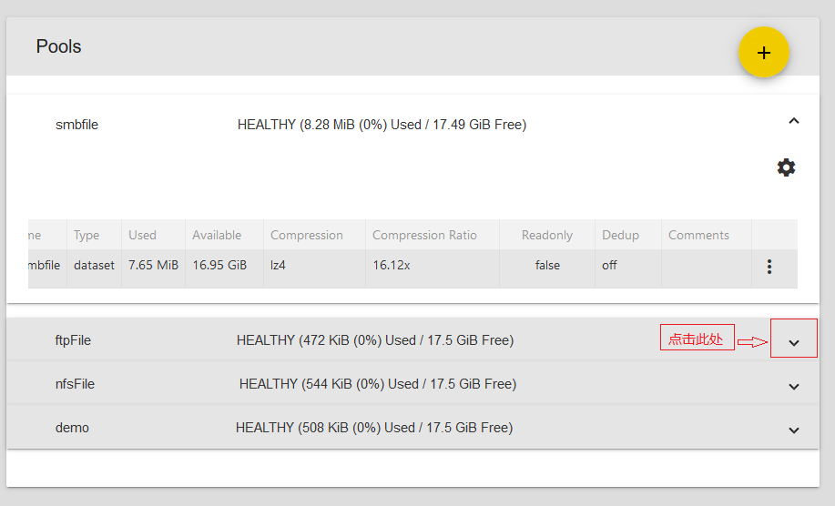
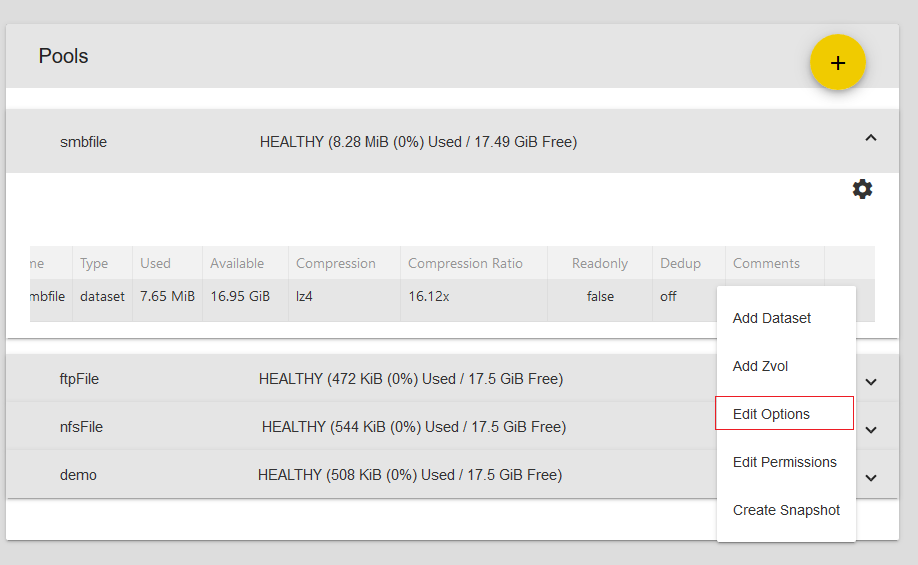
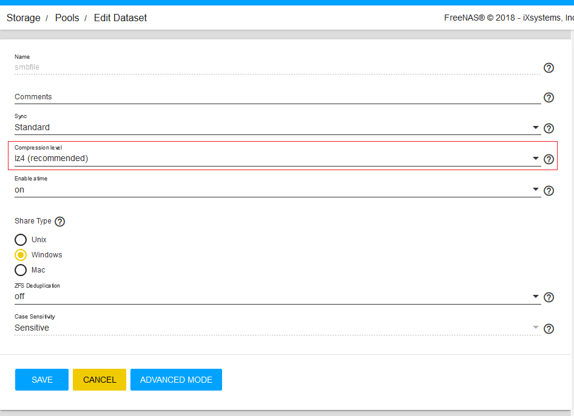
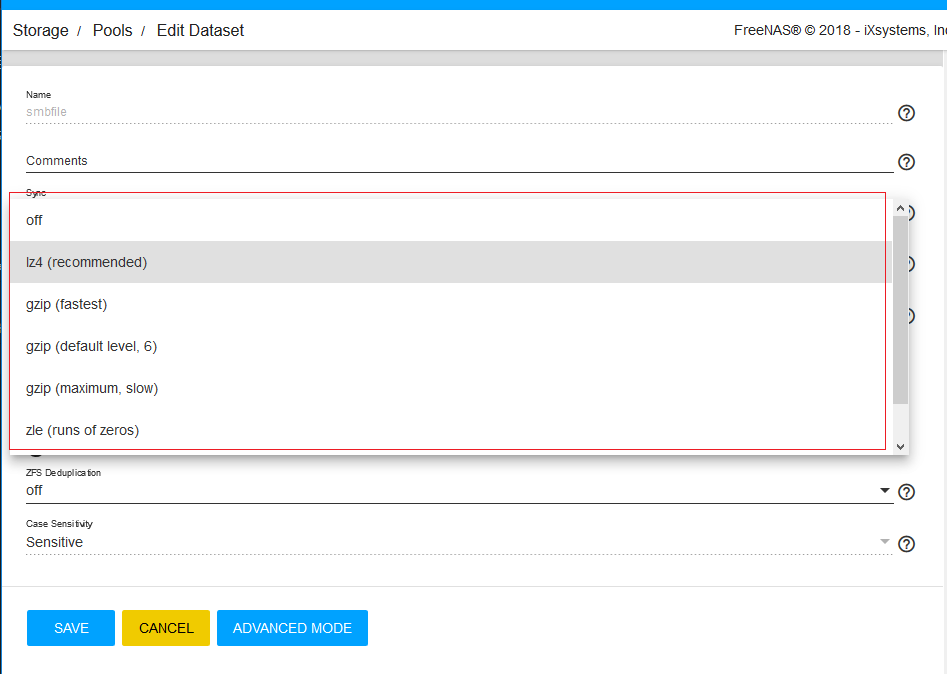
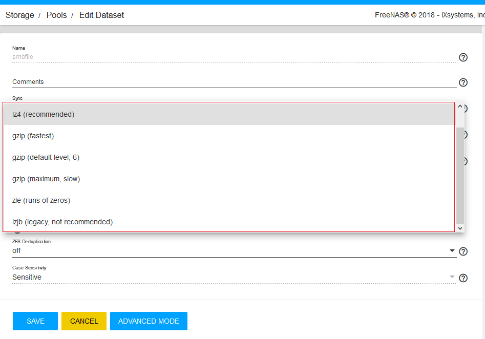

> - 参考文档：
>       [http://www.xiangzhiren.com/archives/317](http://www.xiangzhiren.com/archives/317)
>   参考资料的OS Version: FreeNAS-11.1-U2
>

# 为FreeNAS节约存储空间，是压缩还是重复数据删除

## 压缩方式介绍

- 压缩可以节省更多的存储空间，但强度过大的压缩会对系统性能造成一定的影响，选择压缩类型时，需要在性能与磁盘空间进行权衡。ZFS提供的压缩算法对客户端和应用程序是透明的，因为ZFS在写入压缩数据集或zvol时自动压缩数据，并在数据读取时自动解压缩数据。

- 查看压缩方式
    - 1. 点击下拉箭头
        
    - 2. 选择 Edit Options
        
    - 3. 选择 Compression level
        
    - 4. 列出压缩方式
        
    - 5. 列出其他压缩方式
        

- FreeNAS支持的压缩算法：
    - lz4: 推荐压缩方法，因为它允许压缩数据集以接近实时的速度运行。这是自FreeNAS 9.2.1开始，系统默认选用的压缩算法，它对系统性能影响小，向数据集中存取数据的速度几乎与不采用压缩时一样。
    - gzip: 此压缩算法分为 9 个级别，数字越大，压缩效果越好，速度也最慢。fastest (level 1) 压缩率最低，速度最快。maximum (level 9) 压缩率最高，速度最慢。gzip 压缩算法的默认值为level 6，即压缩率适中，速度也适中。但由于其性能影响而不推荐使用。
    - zle: 快速且简单的压缩方式，采用消除runs of zeroes的方式来压缩空间。
    - lzjb: 压缩能力很好，但仍不推荐使用，因为lz4提供更好的性能。

    通常，如果在创建数据集或zvol时选择Off作为压缩方式，则数据集/zvol不会采用任何压缩方式进行压缩，不推荐禁用压缩。建议采用lz4压缩方式，用微乎其微的性能损失，换取更多的存储空间

## 重复数据删除技术

- Deduplication（重复数据删除）是一种可以大大减少数据的数量的存储技术。ZFS通过比较存储在数据集中重复的数据，对相同数据只保留一个副本，从而消除冗余数据，以此来提高存储系统的效率，有效节约成本、减少传输过程中的占用的网络带宽，是不是听起来很美好？请注意阅读完本文再做决定。

- 按照重复数据删除的粒度可以分为file-level文件级，block-level块级或者byte-level字节级。

    - 文件级的去重对文件作为整体来计算hash签名，如果处理的是自然的文件，则此方法需要的消耗最小，但是缺点是对文件的任何修改都需要重新计算文件的hash签名，即对文件的任何修改，将使得此文件之前节约的空间消失，因为两个文件将不再相同。此种级别的去重比较适合类似JPEG，MPEG等类型的文件，但是对于像虚拟机镜像（大文件）文件将无效，因为即使他们只是很小的一部分不同，但是在文件级别，他们是不同的文件。
    
    - 块级别的去重（相同大小的块），相比文件级的去重，需要更多的计算消耗，但是它能够很好地对像虚拟机镜像类似的大文件去重。大部分的虚拟机镜像文件是重复数据，例如镜像文件中的操作系统部分。使用块级的去重将使得只有镜像特别的数据才占用额外的空间，相同的数据将共享。
    
    - 字节级别的去重，将需要更多的计算消耗来决定重复数据的开始和结束区域，字节级别的去重对mail服务器来说是理想的组合，比如一个邮件的附件可能因为大量转发而出现很多次，但是使用块级别去重时他们并不能被优化。此类型的去重一般用来一些应用程序的去重中，例如exchange server，因为应用程序知道他管理的数据，可以在内部去重。

- ZFS提供了块级别的去重技术，此种技术更适合通用的情况。如果在ZFS Deduplication中选择On，则默认使用SHA256来计算block的hash签名；如果选择verify，则在验证block的hash签名时，倘若发现两个block具有相同的hash签名为了确保block内容相同，ZFS将对block进行逐字节比较。SHA256计算的hash签名相同的情况极为罕见，当然，不能说完全没有，比如买彩票还有人中头奖，是不？

- ZFS采用Deduplication能节约的存储空间取决于存入数据集中重复数据的总量。但是，这种技术非常耗费内存，按照官方的建议，通常1TB存储空间需要额外提供5GB的内存。当启用Deduplication时，向数据集写入的数据越多，所需的内存就越多。如果内存过小，容量不足以保存DDT（重复数据删除表），系统会将DDT存储在磁盘上，这将会导致系统性能一落千丈，直至系统崩溃，这就是那个传说中像月球表面一样的陨石坑。此时唯一的解决方案是添加更多的内存或重新创建池。所以，按照官方的说法，除非有大量内存或者存储的数据中有大量的重复数据，否则，请保证将”ZFS Deduplication”设置为“off”。

- 看到这里，是不是已经后悔新建数据集时开启了”ZFS Deduplication”？请再次注意，如果想禁用数据集的”ZFS Deduplication”，这里还有另一个陨石坑：启用重复数据删除后，禁用它的唯一方法是使用Shell的命令：
> zfs set dedup=off dataset_name

- 但是，如果在shell中关闭了数据集的去重，数据集中所有经过Deduplication处理过的数据都会因为失去那部分重复数据而失效。所以，最好的方法是，新建一个没有启用”ZFS Deduplication”的数据集，将需要禁用”ZFS Deduplication”的数据集中的数据全部复制到新数据集中，然后再删除原始数据集。如果觉得这样复制再删除无伤大雅的话，请想象一个4T的卷，里面有一个开启了重复数据删除的数据集，保存了大约40T的虚拟机映像，哈哈哈。

- 重复数据删除通常在使用若干非常相似的虚拟机映像时考虑，就像上文我举例一样。即使这样，在实际场景中，仍然不建议开启”ZFS Deduplication”，因为还有更具性价比的实现方法。例如，为标准虚拟机创建一个数据集，然后为其他虚拟机克隆该数据集。这样，在克隆的数据集中只保存了每个新建的虚拟机和被克隆的原始数据集之间的差异，从而达到重复数据删除的效果，而不会因为重复数据删除产生额外的内存开销。

## 总结

- 相信通过上面的介绍，为FreeNAS节约存储空间，是压缩还是重复数据删除大家一定已经有了答案。为了节约相对便宜的磁盘的存储空间而给系统增加大量的相对昂贵的内存，不管是出于性能还是成本的考虑，请使用压缩而不是开启重复数据删除选项。在现阶段的技术层次中，珍爱生命，远离去重。
