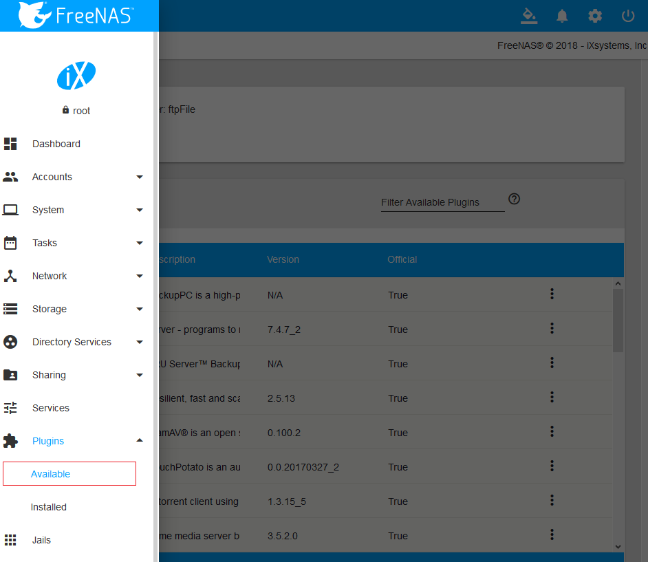
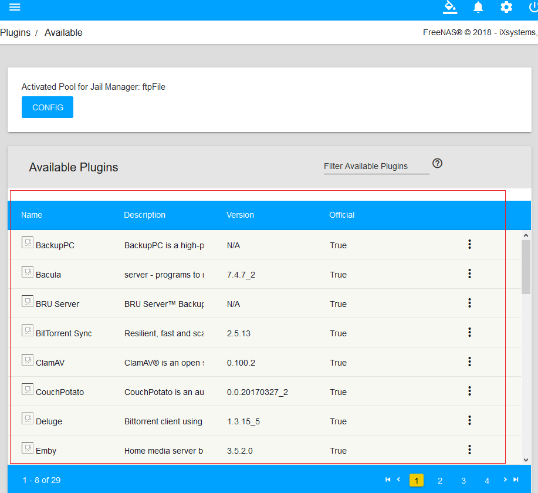
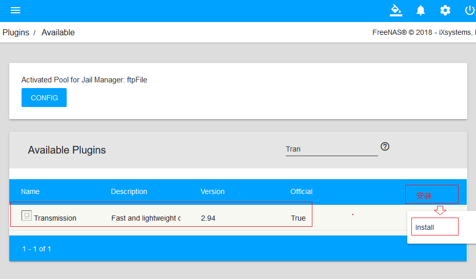
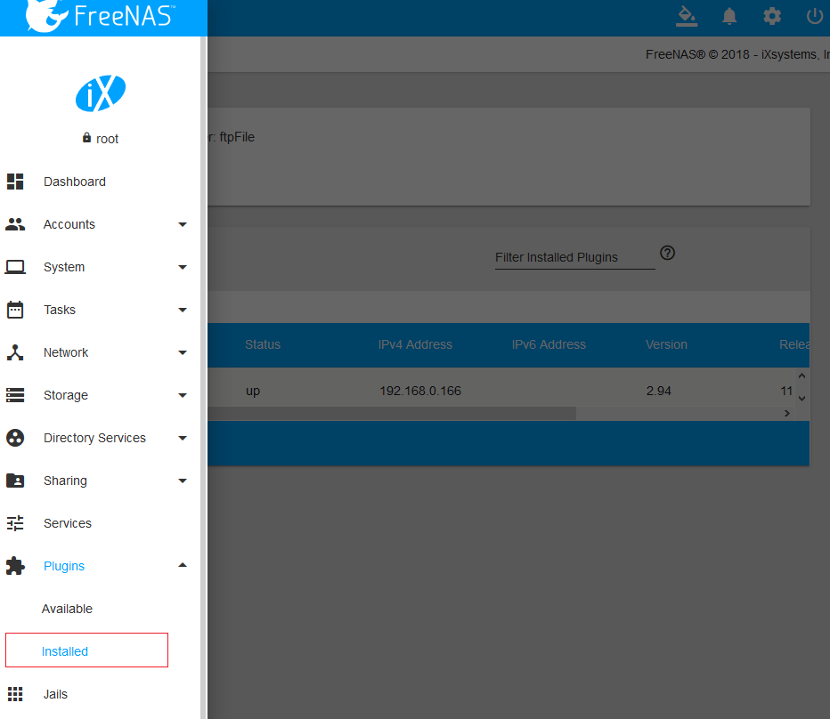
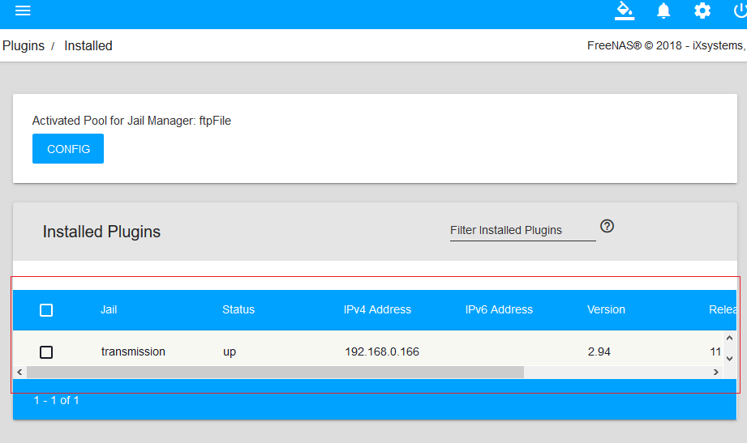
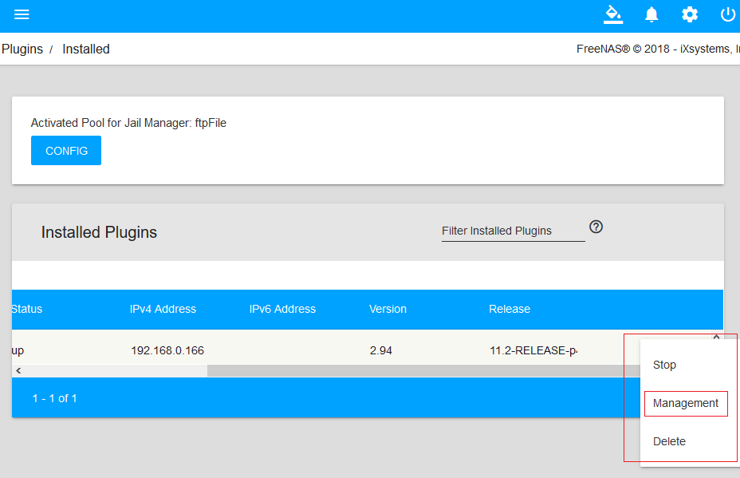

> 参考资料：
>   [http://www.xiangzhiren.com/archives/449](http://www.xiangzhiren.com/archives/449)
>   参考资料的OS Version: FreeNAS-11.1-U2
> 
# 通过插件扩展FreeNAS的功能

## 插件概览
- 在WebUI中点击“Plugins”选择“Available”
- 
- 

## 安装插件
- 

## 查看安装的插件
- 
- 

## 查看管理信息
- 
- 