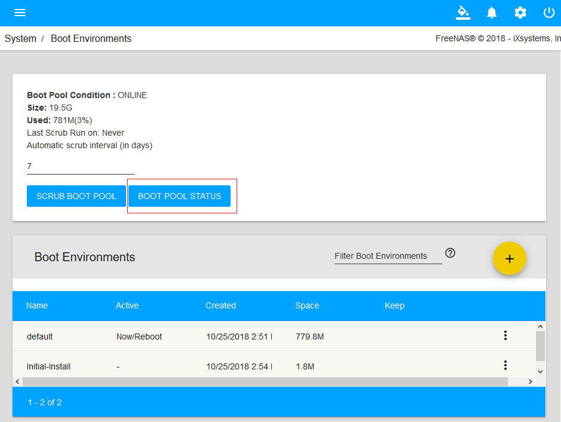

> - 参考文档：
>       [http://www.xiangzhiren.com/archives/374](http://www.xiangzhiren.com/archives/374)
>   参考资料的OS Version: FreeNAS-11.1-U2
>

# 镜像引导设备

- FreeNAS官方建议将FreeNAS系统安装在”一个以上独立的”设备上，”独立”很好理解，就是说要把系统和存储分离，这个安装设备是与存储设备互相独立的，系统盘不保存数据，数据盘不用于安装。FreeNAS每一个系统更新都会再自动创建一个新的引导环境，所以，至少8GB的容量来保证足够的空间来保存更多的引导环境。

## 添加镜像引导设备
- 在WebUI中点击“System”，再点击“Boot Environments”引导环境，再点击“BOOT POOL STATUS”查看引导设备的状态。
    - 
    - 
- 添加引导设备
    - 
    - 
    - 
    - 
- 替换失效引导设备
    - Detach：分离卷。将选中的引导设备从卷中删除。
    - Replace：更换磁盘。用新设备替换选中设备